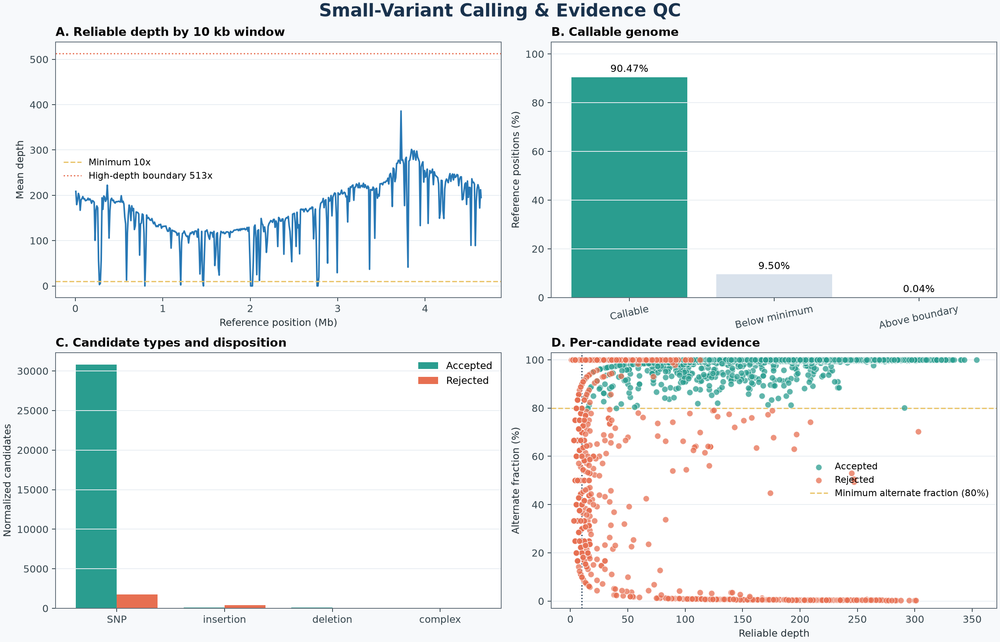

# Small-Variant Calling & Evidence QC Explorer

[](https://github.com/pankhilpandya01-star/bioinformatics-project-12-small-variant-evidence-qc-explorer/actions/workflows/tests.yml)


[](LICENSE)

Small-Variant Calling & Evidence QC Explorer is Project 12 in a progressive
bioinformatics learning portfolio. It extends Project 11's paired-end mapping
workflow by preparing a variant-ready BAM, calling haploid SNPs and short
insertions/deletions, and grading the read evidence for every candidate.

The central question is:

> Which small DNA differences have enough reliable read evidence to keep, and
> which should be treated as uncertain?

This is a deliberate one-level progression. It retains the Python CLI, strict
validation, atomic outputs, checksums, tests, and dashboard-first reporting from
earlier projects while adding duplicate marking, chromosome-wide callability,
BCF/VCF processing, haploid genotypes, normalization, and named evidence
filters.

## Workflow

```text
Project 11 coordinate-sorted paired BAM
                    |
          collate -> fixmate -> coordinate sort -> mark duplicates
                    |
             indexed variant-ready BAM
                    |
       Q20 bases + MAPQ20 reads -> chromosome-wide reliable depth
                    |
             BCFtools haploid candidate calling
                    |
      left normalization + multiallelic splitting + exact deduplication
                    |
          six transparent evidence checks per candidate
                    |
      accepted VCF + rejected VCF + CSVs + reports + dashboard
```

Duplicate records remain in the BAM for auditing but do not count as independent
depth evidence. Weak candidates remain in the rejected VCF with every applicable
reason; they are not silently deleted.

## Verified authentic result

The bundled analysis uses the complete public `SRR13921545` run and the RefSeq
MG1655 chromosome `NC_000913.3`.

| Metric | Result |
| --- | ---: |
| Input paired templates | 5,094,925 |
| Alignment records preserved | 10,164,418 / 10,164,418 |
| Records marked duplicate | 1,276,720 (12.56%) |
| Mean reliable depth after duplicate exclusion | 165.59x |
| Reference positions at depth 10+ | 90.50% |
| Callable positions, 10x through 513x | 90.47% |
| Normalized candidates | 33,203 |
| Accepted under fixed evidence rules | 30,973 (93.28%) |
| Rejected with one or more warnings | 2,230 (6.72%) |
| Accepted SNPs / insertions / deletions | 30,786 / 94 / 93 |



The candidate count requires caution. The public experiment and reference are
both labelled *E. coli* K-12 MG1655, so more than 30,000 strongly supported
differences are unexpected. The workflow reports this as a QC finding that needs
independent provenance, reference, and protocol validation—not as proof of
30,973 biological mutations. See the [authentic analysis](docs/authentic_analysis.md).

The review trail is preserved in the
[dataset decision](docs/dataset_review.md),
[variant-ready BAM review](docs/variant_ready_bam.md),
[controlled variant review](docs/controlled_variant_review.md), and
[quality review](docs/quality_review.md).

## The new concepts in plain language

- **Duplicate marking:** repeated fragments are flagged so repeated measurement
  is not mistaken for independent evidence.
- **Depth:** the number of reliable reads covering one reference position.
- **Callable position:** a reference base with enough evidence to inspect but not
  unusually high depth that may signal ambiguity.
- **Haploid calling:** the bacterium is evaluated as having one expected DNA
  version at each chromosome position.
- **SNP:** one reference letter is replaced by another.
- **Insertion/deletion:** letters are added or removed relative to the reference.
- **Normalization:** equivalent indels receive a consistent left-aligned
  representation, and multiallelic sites are split into one alternate allele per
  row.
- **VCF:** a structured text format that records each candidate, its evidence,
  and the reasons it passed or was rejected.

## What the program does

- validates FASTA structure, BAM integrity, coordinate sorting, BAM indexes,
  reference-contig agreement, read groups, sample identity, and CLI values;
- requires exact Samtools 1.24 and BCFtools 1.24 versions;
- marks duplicate fragments without removing alignment records;
- confirms output BAM integrity and exact record preservation;
- measures quality-filtered depth at every reference position;
- calls haploid SNP and short-indel candidates with BCFtools;
- left-aligns indels, splits multiallelic sites, and removes exact duplicates;
- assigns `LowQual`, `LowDepth`, `HighDepth`, `LowAltDepth`,
  `LowAltFraction`, and `OneStrandOnly` independently;
- writes accepted and rejected compressed VCFs with CSI indexes;
- records one evidence CSV row per normalized candidate;
- reconciles BAM, VCF, CSV, summary, dashboard, and manifest totals;
- records portable commands, versions, parameters, checksums, and counts; and
- publishes a completed directory atomically or leaves no partial result.

## Dataset and reference

| Input | Provenance |
| --- | --- |
| Paired reads | [`SRR13921545` / `SRX10301019`](https://www.ncbi.nlm.nih.gov/sra/SRX10301019), complete 5,094,925-pair run |
| Upstream mapping | [Project 11 — Paired-End Mapping & Fragment QC Explorer](https://github.com/pankhilpandya01-star/bioinformatics-project-11-paired-end-fragment-qc-explorer) |
| Reference assembly | [NCBI RefSeq `GCF_000005845.2` / ASM584v2](https://www.ncbi.nlm.nih.gov/datasets/genome/GCF_000005845.2/) |
| Reference sequence | `NC_000913.3`, 4,641,652 bases |

Project 11's 5,000-pair subset is useful for learning mapping but provides only
0.19x reliable mean depth and no positions at depth 10. Project 12 tested the
predefined larger cohorts without weakening its gate: 500,000 pairs failed the
90%-at-10x requirement, one million pairs missed it by 0.07 percentage points,
and the complete run passed. See [data provenance](docs/data_provenance.md) and
the machine-readable [`source_metadata.csv`](data/source_metadata.csv).

## Installation

The tested environment uses Bioconda tools on Linux. It also runs under WSL2 on
Windows.

```bash
git clone https://github.com/pankhilpandya01-star/bioinformatics-project-12-small-variant-evidence-qc-explorer.git
cd bioinformatics-project-12-small-variant-evidence-qc-explorer
micromamba create -f environment.yml
micromamba activate small-variant-explorer
python -m pip install --no-deps .
```

Equivalent `mamba env create -f environment.yml` or
`conda env create -f environment.yml` commands may be used. The environment pins
Python 3.12, Cutadapt 5.2, Bowtie2 2.5.5, Samtools 1.24, BCFtools 1.24,
Matplotlib 3.11.1, and SRA Toolkit 3.4.1.

Confirm the installation:

```bash
python --version
samtools --version
bcftools --version
small-variant-explorer --help
```

## Usage

Run the complete preparation and calling workflow from a new output path:

```bash
small-variant-explorer \
  --reference-fasta data/local/GCF_000005845.2_ASM584v2_genomic.fna \
  --input-bam results/local/project11_full/trimmed_paired.sorted.bam \
  --sample-id SRR13921545 \
  --ploidy 1 \
  --minimum-mapq 20 \
  --minimum-base-quality 20 \
  --minimum-depth 10 \
  --minimum-alt-depth 5 \
  --minimum-alt-fraction 0.8 \
  --minimum-variant-quality 30 \
  --minimum-alt-strand-depth 1 \
  --maximum-depth-factor 3 \
  --threads 1 \
  --output-dir results/local/reproduction_run
```

The output directory must not already exist. The equivalent module command is
`python -m small_variant_explorer` with the same options.

The paths above are repository-relative examples. Large inputs are retrieved
locally and are not included in the public repository.

## CLI

```text
small-variant-explorer
  --reference-fasta PATH
  --input-bam PATH
  --sample-id TEXT
  [--ploidy {1,2}]
  [--minimum-mapq 0..255]
  [--minimum-base-quality 0..255]
  [--minimum-depth POSITIVE_INTEGER]
  [--minimum-alt-depth POSITIVE_INTEGER]
  [--minimum-alt-fraction NUMBER]
  [--minimum-variant-quality NONNEGATIVE_NUMBER]
  [--minimum-alt-strand-depth NONNEGATIVE_INTEGER]
  [--maximum-depth-factor NUMBER_GREATER_THAN_1]
  [--threads POSITIVE_INTEGER]
  --output-dir PATH
```

Defaults are bacterial ploidy 1, MAPQ20, base quality 20, depth 10, alternate
depth 5, alternate fraction 80%, variant quality 30, at least one alternate read
on each strand, a three-times-median high-depth factor with a floor of 50, and
one thread.

## Evidence rules and denominators

Every reference-depth percentage uses all 4,641,652 chromosome positions,
including zero-depth bases. The 513x authentic high-depth boundary is three
times the 171x chromosome-wide median.

A candidate passes only when it satisfies every configured rule:

```text
QUAL >= 30
10 <= reliable depth <= high-depth boundary
alternate depth >= 5
alternate depth / total depth >= 0.80
alternate forward depth >= 1
alternate reverse depth >= 1
```

Filter reasons overlap. A weak record may receive several warnings, but it still
appears exactly once in the rejected VCF. `PASS` means “supported under these
settings,” not “uniquely correct” or “biologically proven.”

## Output contract

The CLI publishes two stages together:

| Artifact | Purpose |
| --- | --- |
| `preparation/bam/variant_ready.sorted.bam(.bai)` | Coordinate-sorted, duplicate-marked evidence BAM |
| `preparation/reports/` | Duplicate, flagstat, stats, coverage, and index reports |
| `preparation/depth/` | Position depth, coverage summary, callable BED, and 10 kb windows |
| `calling/raw/candidates.bcf(.csi)` | Unnormalized caller output |
| `calling/vcf/candidates.normalized.vcf.gz(.csi)` | Left-normalized, split, deduplicated candidates |
| `calling/vcf/evaluated.vcf.gz(.csi)` | All candidates with final filter labels |
| `calling/vcf/accepted.vcf.gz(.csi)` | Candidates passing all six evidence rules |
| `calling/vcf/rejected.vcf.gz(.csi)` | Candidates preserving one or more warnings |
| `calling/reports/variant_evidence.csv` | One row per normalized candidate |
| `calling/reports/*summary.csv` | Variant-type, substitution, and filter totals |
| `calling/reports/*.bcftools.stats.txt` | Machine-readable callset statistics |
| `calling/dashboard/variant_evidence_dashboard.png` | Depth, callability, type, and evidence overview |
| Stage and top-level `run_manifest.json` files | Parameters, versions, portable commands, checksums, and counts |

Large FASTQ, BAM, raw BCF, and position-level depth files remain local. The
repository retains reproducibility instructions, checksums, compact VCF/CSV
results, controlled fixtures, reports, and the dashboard.

## Testing and continuous integration

Run the suite inside the pinned environment:

```bash
python -m unittest discover -s tests -v
```

All 27 tests pass. They cover malformed FASTA/BAM/VCF inputs, invalid samples
and thresholds, reference disagreement, multiple samples, duplicates, MAPQ and
base-quality exclusion, low and excessive depth, all six evidence warnings,
SNPs, insertions, deletions, multiallelic splitting, left normalization, empty
callsets, exact partitioning, subprocess failures, atomic cleanup, source
immutability, and authentic-result reconciliation.

GitHub Actions is configured to run the same suite on Python 3.12 with the
pinned Bioconda tools for pushes, pull requests, and manual runs.

## Repository structure

```text
bioinformatics-project-12-small-variant-evidence-qc-explorer/
|-- .github/workflows/tests.yml
|-- data/source_metadata.csv
|-- docs/
|   |-- milestone reviews
|   |-- data_provenance.md
|   |-- limitations.md
|   |-- methods.md
|   |-- publication_checklist.md
|   `-- references.md
|-- examples/controlled/
|-- results/
|   |-- authentic_analysis/
|   |-- controlled_variant_calling/
|   |-- dataset_review/
|   `-- variant_ready/
|-- scripts/summarize_depth.py
|-- src/small_variant_explorer/
|-- tests/
|-- environment.yml
|-- LICENSE
|-- pyproject.toml
`-- README.md
```

## Interpretation and boundaries

The workflow examines small variants under one documented configuration. It
does not perform gene annotation, effect prediction, antimicrobial-resistance
claims, clinical interpretation, structural-variant analysis, copy-number
analysis, assembly, phylogeny, joint calling, or consensus-genome construction.

The result depends on the selected sample, reference, upstream alignment, caller,
and thresholds. See [methods](docs/methods.md), [limitations](docs/limitations.md),
and the [quality review](docs/quality_review.md) for the complete boundaries and
verification evidence.

## What this project demonstrates

- why variant calling requires genome-wide depth rather than a small mapping
  demonstration subset;
- how duplicate flags preserve audit evidence without counting repeated reads as
  independent support;
- how haploid calling differs from simply listing mismatches;
- why indels are normalized before they receive stable keys;
- how separate depth, alternate-fraction, strand, and quality rules remain
  transparent;
- how accepted and rejected VCFs can preserve every candidate exactly once;
- how cross-artifact reconciliation and atomic publication strengthen
  reproducibility; and
- why an unexpected high-confidence result should trigger QC investigation
  rather than an overstated conclusion.

## Portfolio progression

Previous project:
[Paired-End Mapping & Fragment QC Explorer](https://github.com/pankhilpandya01-star/bioinformatics-project-11-paired-end-fragment-qc-explorer)

Project 11 established paired mapping, proper-pair evidence, read groups, and
the BAM design. Project 12 uses that foundation for small-variant evidence QC.
A later project can add gene annotation and explain which genomic features the
accepted candidates affect, after the sample/reference discrepancy is resolved.

Browse the complete portfolio on the
[GitHub profile](https://github.com/pankhilpandya01-star?tab=repositories).

## References and license

Technical and scientific sources are listed in [references](docs/references.md).
Project code and documentation are available under the [MIT License](LICENSE).
External sequence data and reference files remain attributable to their original
repositories and are not relicensed by this project.
